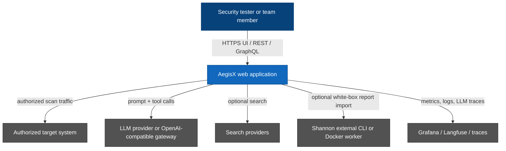
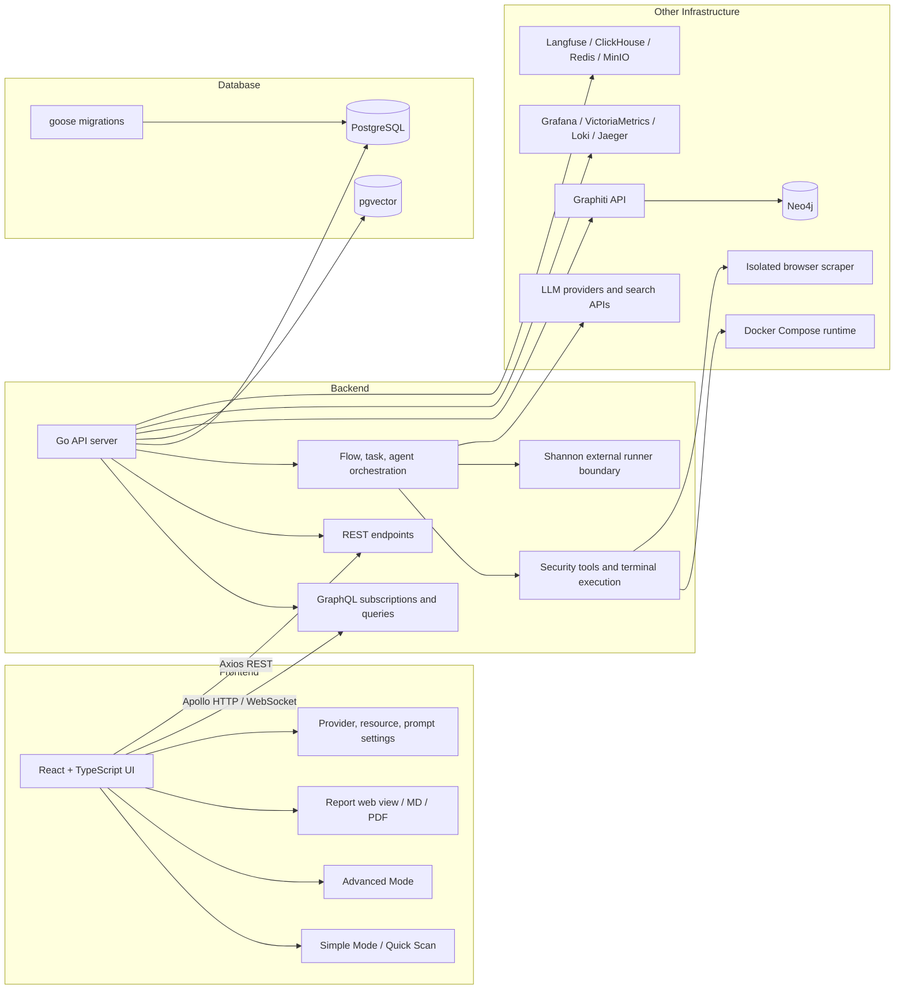

# AegisX

## Contributors

<table>
  <tr>
    <td align="center">
      <a href="https://github.com/RatelXD">
        
        <br />
        <sub><b>@RatelXD</b></sub>
      </a>
    </td>
    <td align="center">
      <a href="https://github.com/DDangtoad">
        
        <br />
        <sub><b>@DDangtoad</b></sub>
      </a>
    </td>
    <td align="center">
      <a href="https://github.com/jinu-park123">
        
        <br />
        <sub><b>@jinu-park123</b></sub>
      </a>
    </td>
  </tr>
</table>

> Contributors listed here are AegisX fork participants. Upstream PentAGI contributor attribution is preserved in [CONTRIBUTORS.md](CONTRIBUTORS.md).

## Overview

**AegisX**는 [PentAGI](https://github.com/vxcontrol/pentagi)를 기반으로 한 AI-assisted security testing 프로젝트입니다. 기존 PentAGI의 Go backend, React frontend, Docker 기반 실행 환경, LLM provider, observability 구조를 유지하면서 AegisX 프로젝트 목적에 맞게 다음 흐름을 보강합니다.

- **Simple Mode**: 보안 전문 지식이 많지 않은 사용자도 승인된 대상의 기본 보안 상태를 빠르게 점검할 수 있는 한국어 중심 workflow
- **Quick Scan**: `<빠른 점검>` marker 기반의 제한된 5~10분 점검 흐름, OWASP Top 10:2025 기준 요약 보고서
- **Advanced Mode**: 기존 PentAGI flow/task/agent/terminal/resource 기능을 유지한 전문가용 점검 화면
- **Shannon integration**: Shannon을 AegisX 내부 코드로 복사하지 않고, 외부 CLI 또는 Docker worker 경계에서 호출해 markdown report를 flow 결과로 가져오는 보조 기능
- **Report workflow**: web view, Markdown download, PDF download를 지원하는 AegisX 보안 보고서 흐름

Repository: <https://github.com/2026OpenSourceSW/AegisX>

## Table of Contents

- [Contributors](#contributors)
- [Overview](#overview)
- [Project Goals](#project-goals)
- [Current Capabilities](#current-capabilities)
- [Architecture](#architecture)
  - [System Context](#system-context)
  - [Component Architecture](#component-architecture)
  - [Frontend](#frontend)
  - [Backend](#backend)
  - [Database](#database)
  - [Other Infrastructure](#other-infrastructure)
- [Quick Start](#quick-start)
- [Development](#development)
- [Security And Safety](#security-and-safety)
- [License And Notices](#license-and-notices)

## Project Goals

AegisX는 "AI가 알아서 공격한다"는 데모보다, 팀원이 실제로 이해하고 검증할 수 있는 보안 점검 흐름을 목표로 합니다.

1. 승인된 대상만 점검하도록 UX와 prompt를 안전하게 제한합니다.
2. Simple Mode에서 점검 범위, 예상 시간, 보고서 형식을 더 쉽게 이해할 수 있게 합니다.
3. Advanced Mode에서는 PentAGI의 agent, terminal, resources, settings, provider 기능을 유지합니다.
4. 결과 보고서는 한국어 설명, 근거, OWASP Top 10:2025 분류, 추가 정밀 점검 필요 여부를 포함합니다.
5. Shannon은 외부 통합으로 유지해 AGPL 경계를 분리하고, AegisX 저장소에 Shannon source를 복사하지 않습니다.

## Current Capabilities

| Area            | Status                                                                                                        |
| --------------- | ------------------------------------------------------------------------------------------------------------- |
| Simple Mode     | Quick Scan 중심의 한국어 guided workflow                                                                      |
| Advanced Mode   | PentAGI 기반 flow/task/agent/terminal workflow 유지                                                           |
| LLM providers   | OpenAI, Anthropic, Gemini, AWS Bedrock, Ollama, DeepSeek, GLM, Kimi, Qwen, custom/OpenAI-compatible endpoints |
| Reports         | Web view, clipboard copy, Markdown download, PDF download                                                     |
| Shannon         | Optional external CLI/Docker worker integration                                                               |
| Storage         | PostgreSQL + pgvector 기반 flow/task/log/memory/vector data                                                   |
| Observability   | OpenTelemetry, Grafana stack, Langfuse stack optional                                                         |
| Knowledge graph | Graphiti + Neo4j optional stack                                                                               |

### Boundaries

- AegisX는 허가 없는 침투 테스트를 위한 도구가 아닙니다. 본인이 소유하거나 명시적으로 점검 권한을 받은 대상에서만 사용해야 합니다.
- Simple Mode의 Quick Scan은 빠른 외부 노출 및 핵심 위험 확인용입니다. 깊은 exploit chain 검증이나 장시간 brute force를 목표로 하지 않습니다.
- Shannon은 optional AGPL-3.0 software입니다. AegisX는 Shannon source를 저장소에 포함하지 않으며, 외부 CLI 또는 Docker worker로 호출합니다.
- 일부 binary, package, Docker image, internal identifier는 아직 upstream PentAGI 이름(`pentagi`, `PENTAGI_IMAGE`, `/opt/pentagi`)을 사용합니다. 구현이 바뀌기 전까지 문서에서도 해당 사실을 숨기지 않습니다.

## Architecture

### System Context



### Component Architecture



### Frontend

The frontend lives in [`frontend/`](frontend/) and is inherited from the upstream PentAGI React application with AegisX-specific UI and workflow additions.

- Framework: React, TypeScript, Vite
- Data layer: Apollo Client, GraphQL queries/subscriptions, REST calls where needed
- Main routes: dashboard, flows, new flow, flow report, resources, knowledge, templates, settings
- AegisX additions:
  - Simple Mode entry and Quick Scan scenario
  - Korean UI copy for primary workflows
  - AegisX report web view and PDF/Markdown export polish
  - theme toggle and project branding updates

Key paths:

- [`frontend/src/pages/flows/new-flow.tsx`](frontend/src/pages/flows/new-flow.tsx)
- [`frontend/src/features/flows/simple-mode-scenarios.tsx`](frontend/src/features/flows/simple-mode-scenarios.tsx)
- [`frontend/src/features/flows/simple-mode-report-guidance.ts`](frontend/src/features/flows/simple-mode-report-guidance.ts)
- [`frontend/src/pages/flows/flow-report.tsx`](frontend/src/pages/flows/flow-report.tsx)
- [`frontend/src/lib/report/`](frontend/src/lib/report/)

### Backend

The backend lives in [`backend/`](backend/) and keeps the upstream Go service architecture.

- Main binary: [`backend/cmd/pentagi`](backend/cmd/pentagi)
- API: Gin REST server and gqlgen GraphQL schema/resolvers
- Orchestration: flow, task, subtask, assistant, controller, queue, tool execution
- LLM providers: OpenAI, Anthropic, Gemini, Bedrock, Ollama, DeepSeek, GLM, Kimi, Qwen, custom/OpenAI-compatible providers
- AegisX additions:
  - Quick Scan execution constraints and prompt context
  - report prompt guidance for OWASP Top 10:2025 and readable headings
  - optional Shannon bridge under an external runner boundary

Key paths:

- [`backend/pkg/server/`](backend/pkg/server/)
- [`backend/pkg/graph/`](backend/pkg/graph/)
- [`backend/pkg/controller/`](backend/pkg/controller/)
- [`backend/pkg/providers/`](backend/pkg/providers/)
- [`backend/pkg/tools/`](backend/pkg/tools/)
- [`backend/pkg/templates/prompts/`](backend/pkg/templates/prompts/)
- [`backend/pkg/shannon/`](backend/pkg/shannon/)

### Database

AegisX uses PostgreSQL as the main application database and pgvector for vector search and memory features.

- Required service: `pgvector` in [`docker-compose.yml`](docker-compose.yml)
- Migrations: [`backend/migrations/sql/`](backend/migrations/sql/)
- Database package: [`backend/pkg/database/`](backend/pkg/database/)
- Stored data includes users, providers, flows, tasks, subtasks, logs, tool calls, resources, knowledge, and vector memory.

Optional database-backed integrations:

- Neo4j for Graphiti knowledge graph (`docker-compose-graphiti.yml`)
- ClickHouse, Redis, MinIO, and Postgres for Langfuse (`docker-compose-langfuse.yml`)
- VictoriaMetrics, Loki, Jaeger storage for observability (`docker-compose-observability.yml`)

### Other Infrastructure

- **Docker Compose**: local and staging runtime for `pentagi`, `pgvector`, `scraper`, exporters, and optional stacks
- **Scraper**: isolated browser service used by agent workflows
- **Graphiti**: optional knowledge graph service backed by Neo4j
- **Observability**: optional Grafana stack with OpenTelemetry, VictoriaMetrics, Loki, and Jaeger
- **Langfuse**: optional LLM observability stack
- **External providers**: LLM APIs, OpenAI-compatible gateways such as OpenRouter, and search APIs
- **Shannon**: optional external CLI/Docker worker used only when explicitly enabled and configured

## Quick Start

### 1. Clone

```bash
git clone https://github.com/2026OpenSourceSW/AegisX.git
cd AegisX
git checkout develop
```

### 2. Configure `.env`

Start from the project environment template used by the inherited PentAGI stack.

```bash
cp .env.example .env
```

At minimum configure:

- database values used by `pgvector`
- one LLM provider key or OpenAI-compatible endpoint
- HTTPS/domain values required by the local Docker stack

Do not commit `.env`. It is ignored and should stay local.

### 3. Run with Docker Compose

```bash
docker compose up -d
```

Open:

```text
https://localhost:8443
```

The upstream default local account is retained unless changed by deployment configuration:

```text
admin@pentagi.com / admin
```

### 4. Optional stacks

```bash
# Monitoring
docker compose -f docker-compose.yml -f docker-compose-observability.yml up -d

# LLM analytics
docker compose -f docker-compose.yml -f docker-compose-langfuse.yml up -d

# Knowledge graph
docker compose -f docker-compose.yml -f docker-compose-graphiti.yml up -d
```

## Development

### Frontend

```bash
cd frontend
pnpm install
pnpm run dev
pnpm run test
pnpm run lint
pnpm run build
```

### Backend

```bash
cd backend
go mod download
go test ./...
go build -trimpath -o pentagi ./cmd/pentagi
```

### Docker image

```bash
docker build -t aegisx:develop .
PENTAGI_IMAGE=aegisx:develop docker compose up -d --force-recreate
```

The runtime still uses several upstream names and paths, including the `pentagi` container, `/opt/pentagi`, and `PENTAGI_IMAGE`.

## Security And Safety

- Run scans only against systems you own or have explicit permission to test.
- Prefer local or staging targets for validation.
- Keep LLM provider keys in `.env` or secret managers, never in commits or PR text.
- Simple Mode Quick Scan should remain time-boxed and avoid long brute-force or out-of-scope exploitation.
- Shannon may execute deeper white-box checks; use it only with explicit target authorization and non-production safeguards.

## License And Notices

AegisX is derived from upstream PentAGI and preserves the upstream MIT license context.

- [LICENSE](LICENSE) contains the canonical MIT license text for the PentAGI-derived codebase.
- [NOTICE](NOTICE) preserves upstream PentAGI attribution and records AegisX modification context.
- [CONTRIBUTORS.md](CONTRIBUTORS.md) keeps upstream PentAGI contributor attribution and AegisX fork context.
- [licenses/README.md](licenses/README.md) summarizes generated dependency license reports and third-party notice guidance.
- [CONTRIBUTING.md](CONTRIBUTING.md) is the source of truth for AegisX branch, PR, verification, and license workflow.

Shannon is optional AGPL-3.0 software and remains outside the AegisX source tree. Keep Shannon license and notices with the installed Shannon distribution, and do not copy Shannon source into this repository.
