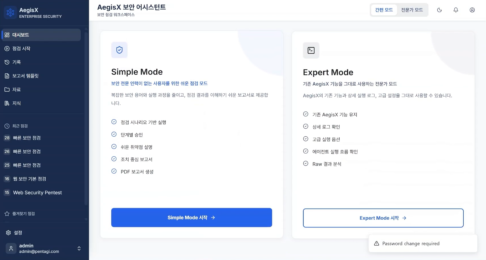
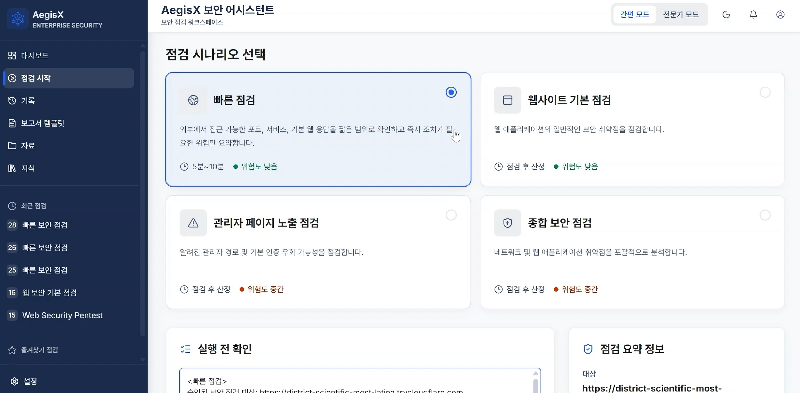
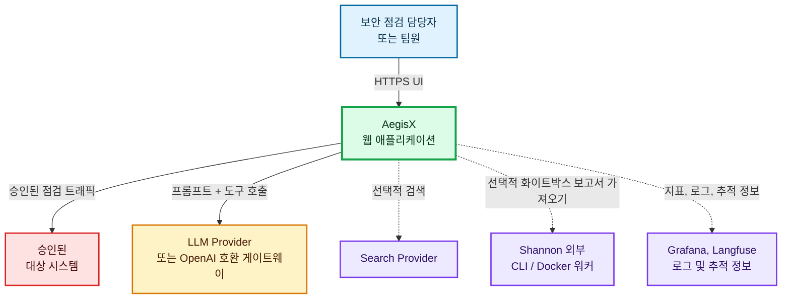
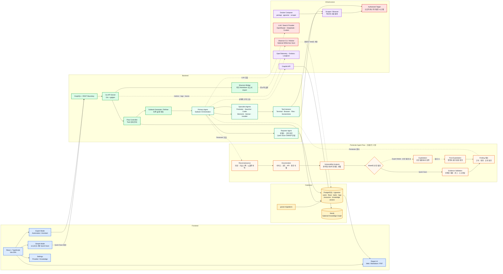

# AegisX

## 기여자

<table>
  <tr>
    <td align="center">
      <a href="https://github.com/RatelXD">
        
        <br />
        <sub><b>@RatelXD</b></sub>
      </a>
    </td>
    <td align="center">
      <a href="https://github.com/DDangtoad">
        
        <br />
        <sub><b>@DDangtoad</b></sub>
      </a>
    </td>
    <td align="center">
      <a href="https://github.com/jinu-park123">
        
        <br />
        <sub><b>@jinu-park123</b></sub>
      </a>
    </td>
  </tr>
</table>

> 이 목록은 AegisX 포크 프로젝트 참여자입니다. 원본 PentAGI 기여자 표기는 [CONTRIBUTORS.md](CONTRIBUTORS.md)에 보존합니다.

## 개요

**AegisX**는 [PentAGI](https://github.com/vxcontrol/pentagi)를 기반으로 한 AI 보안 점검 프로젝트입니다. 기존 PentAGI의 Go Backend, React Frontend, Docker 실행 환경, LLM Provider, Observability 구조를 유지하면서 AegisX의 목적에 맞게 다음 기능을 보강했습니다.

- **Simple Mode(간편 모드)**: 보안 비전문가도 승인된 대상의 기본 보안 상태를 빠르게 확인할 수 있는 한국어 중심 점검 흐름
- **Quick Scan(빠른 점검)**: `<빠른 점검>` 마커를 기반으로 5~10분 내에 진행하는 제한적 점검과 OWASP Top 10:2025 기준 요약 보고서
- **Expert Mode(전문가 모드)**: 기존 PentAGI의 Flow, Task, Agent, Terminal, Resource 기능을 유지하는 전문가용 점검 화면
- **Shannon 통합**: Shannon 소스 코드를 AegisX 내부에 복사하지 않고, 외부 CLI 또는 Docker 워커 경계에서 호출해 Markdown 보고서를 flow 결과로 가져오는 보조 기능
- **보고서 흐름**: 웹 보기, Markdown 내려받기, PDF 내려받기를 지원하는 AegisX 보안 보고서 기능

### 화면 미리보기

| 점검 모드 선택 | 점검 시나리오 선택 |
| --- | --- |
|  |  |

저장소: <https://github.com/2026OpenSourceSW/AegisX>

## 목차

- [기여자](#기여자)
- [개요](#개요)
- [프로젝트 목표](#프로젝트-목표)
- [현재 기능](#현재-기능)
- [아키텍처](#아키텍처)
  - [시스템 컨텍스트](#시스템-컨텍스트)
  - [Component Architecture](#component-architecture)
  - [Frontend](#frontend)
  - [Backend](#backend)
  - [Database](#database)
  - [Infrastructure](#infrastructure)
- [빠른 시작](#빠른-시작)
- [개발](#개발)
- [보안 및 안전](#보안-및-안전)
- [라이선스 및 고지](#라이선스-및-고지)

## 프로젝트 목표

AegisX는 "AI가 알아서 공격하는" 데모에 그치지 않고, 팀원이 점검 과정과 결과를 직접 이해하고 검증할 수 있는 흐름을 지향합니다.

1. 승인된 대상만 점검할 수 있도록 UX와 프롬프트를 안전하게 제한합니다.
2. Simple Mode에서 점검 범위, 예상 시간, 보고서 형식을 쉽게 이해할 수 있도록 합니다.
3. Expert Mode에서는 PentAGI의 Agent, Terminal, Resources, Settings, Provider 기능을 유지합니다.
4. 결과 보고서는 한국어 설명, 근거, OWASP Top 10:2025 분류, 추가 정밀 점검 필요 여부를 포함합니다.
5. Shannon은 외부 통합으로 유지해 AGPL 경계를 분리하고, AegisX 저장소에 Shannon 소스 코드를 복사하지 않습니다.

## 현재 기능

| 영역            | 제공 기능                                                                                                     |
| --------------- | ------------------------------------------------------------------------------------------------------------- |
| Simple Mode     | Quick Scan 중심의 한국어 안내형 흐름                                                                           |
| Expert Mode     | PentAGI 기반 Flow/Task/Agent/Terminal 흐름 유지                                                               |
| LLM Provider    | OpenAI, Anthropic, Gemini, AWS Bedrock, Ollama, DeepSeek, GLM, Kimi, Qwen, 사용자 지정/OpenAI 호환 엔드포인트 |
| 보고서          | 웹 보기, 클립보드 복사, Markdown 내려받기, PDF 내려받기                                                        |
| Shannon         | 선택적으로 사용하는 외부 CLI/Docker 워커 통합                                                                 |
| Storage         | PostgreSQL + pgvector 기반 flow/task/log/memory/vector 데이터                                                 |
| Observability   | OpenTelemetry, Grafana 스택, 선택적 Langfuse 스택                                                             |
| Knowledge Graph | 선택적 Graphiti + Neo4j 스택                                                                                  |

### 사용 범위

- AegisX는 허가 없는 침투 테스트를 위한 도구가 아닙니다. 본인이 소유하거나 명시적으로 점검 권한을 받은 대상에서만 사용해야 합니다.
- Simple Mode의 Quick Scan은 외부 노출과 핵심 위험을 빠르게 확인하기 위한 기능입니다. 복잡한 Exploit Chain 검증이나 장시간 무차별 대입은 수행하지 않습니다.
- Shannon은 선택적으로 사용할 수 있는 AGPL-3.0 소프트웨어입니다. AegisX는 Shannon 소스 코드를 저장소에 포함하지 않으며, 외부 CLI 또는 Docker 워커로 호출합니다.
- 일부 바이너리, 패키지, Docker 이미지, 내부 식별자는 아직 원본 PentAGI 이름(`pentagi`, `PENTAGI_IMAGE`, `/opt/pentagi`)을 사용합니다. 구현이 바뀌기 전까지 문서에서도 이 사실을 명확히 안내합니다.

## 아키텍처

### 시스템 컨텍스트


```mermaid
flowchart TB
    classDef userNode fill:#e0f2fe,stroke:#0369a1,stroke-width:2px,color:#082f49
    classDef appNode fill:#dcfce7,stroke:#16a34a,stroke-width:3px,color:#052e16
    classDef targetNode fill:#fee2e2,stroke:#dc2626,stroke-width:2px,color:#450a0a
    classDef provider fill:#fef3c7,stroke:#d97706,stroke-width:2px,color:#451a03
    classDef optional fill:#ede9fe,stroke:#7c3aed,stroke-width:2px,color:#2e1065

    user["보안 점검 담당자<br/>또는 팀원"]
    app["AegisX<br/>웹 애플리케이션"]
    target["승인된<br/>대상 시스템"]
    llm["LLM Provider<br/>또는 OpenAI 호환 게이트웨이"]
    search["Search Provider"]
    shannon["Shannon 외부<br/>CLI / Docker 워커"]
    observability["Grafana, Langfuse<br/>로그 및 추적 정보"]

    user -->|"HTTPS UI"| app
    app -->|"승인된 점검 트래픽"| target
    app -->|"프롬프트 + 도구 호출"| llm
    app -.->|"선택적 검색"| search
    app -.->|"선택적 화이트박스 보고서 가져오기"| shannon
    app -.->|"지표, 로그, 추적 정보"| observability

    class user userNode
    class app appNode
    class target targetNode
    class llm provider
    class search,shannon,observability optional
```

### Component Architecture

AegisX는 PentAGI의 동적 Task/Subtask 실행 구조를 그대로 사용합니다. Generator가 입력을 Subtask로 나누고, Primary Agent가 Pentester·Searcher·Coder·Memorist·Adviser를 필요한 시점에 호출합니다. 수집된 실행 결과와 근거는 Reporter가 취약점, 위험도, OWASP Top 10:2025 분류, 조치 방안 중심의 보고서로 정리합니다.

Reconnaissance부터 Post-Exploitation까지의 단계는 Backend에 고정된 상태 머신이 아니라 Pentester Agent의 프롬프트 기반 실행 흐름입니다. Simple Mode의 Quick Scan에서는 광범위한 Exploitation과 Post-Exploitation을 차단하고, 안전한 범위의 노출 확인과 근거 수집만 수행합니다.


```mermaid
flowchart LR
    classDef frontend fill:#dbeafe,stroke:#2563eb,stroke-width:2px,color:#0f172a
    classDef backend fill:#dcfce7,stroke:#16a34a,stroke-width:2px,color:#0f172a
    classDef agent fill:#ecfdf5,stroke:#059669,stroke-width:2px,color:#0f172a
    classDef stage fill:#fff7ed,stroke:#ea580c,stroke-width:2px,color:#0f172a
    classDef database fill:#fef3c7,stroke:#d97706,stroke-width:2px,color:#0f172a
    classDef infra fill:#f3e8ff,stroke:#9333ea,stroke-width:2px,color:#0f172a
    classDef external fill:#fee2e2,stroke:#dc2626,stroke-width:2px,color:#0f172a

    subgraph Frontend["Frontend"]
        direction TB
        WebUI["React + TypeScript<br/>Vite SPA"]
        SimpleMode["Simple Mode<br/>시나리오 기반 Quick Scan"]
        ExpertMode["Expert Mode<br/>Automation / Assistant"]
        ReportUI["Report UI<br/>Web / Markdown / PDF"]
        Settings["Settings<br/>Provider / Knowledge"]
        WebUI --> SimpleMode
        WebUI --> ExpertMode
        WebUI --> ReportUI
        WebUI --> Settings
    end

    subgraph Backend["Backend"]
        direction TB
        EdgeAPI["GraphQL + REST Boundary"]
        API["Go API Server<br/>Gin + gqlgen"]
        FlowController["Flow Controller<br/>Task 상태 관리"]
        Generator["Subtask Generator / Refiner<br/>동적 실행 계획"]
        Primary["Primary Agent<br/>Subtask Orchestration"]
        Specialists["Specialist Agents<br/>Pentester · Searcher · Coder<br/>Memorist · Adviser · Installer"]
        ToolHarness["Tool Harness<br/>Terminal · Browser · Files · Screenshots"]
        Reporter["Reporter Agent<br/>위험도 · 조치 방안<br/>Quick Scan OWASP 분류"]
        ShannonBridge["Shannon Bridge<br/>외부 Markdown 보고서 import"]

        EdgeAPI --> API --> FlowController --> Generator --> Primary
        Primary --> Specialists --> ToolHarness
        Specialists --> Primary
        Primary --> Reporter
        API --> ShannonBridge
    end

    subgraph Assessment["Pentester Agent Flow · 프롬프트 기반"]
        direction TB
        Recon["Reconnaissance<br/>대상 · 기술 스택 · 노출면 파악"]
        Enum["Enumeration<br/>서비스 · 포트 · API · 경로 식별"]
        Analyze["Vulnerability Analysis<br/>취약점 후보와 위험도 판별"]
        Scope{"Mode와 승인 범위"}
        Validate["Evidence Validation<br/>안전한 재현 · 로그 · 스크린샷"]
        Exploit["Exploitation<br/>승인 범위에서 검증"]
        PostExploit["Post-Exploitation<br/>영향과 권한 범위 확인"]
        Findings["Finding 정리<br/>근거 · 영향 · 조치 방안"]

        Recon --> Enum --> Analyze --> Scope
        Scope -->|"Quick Scan"| Validate --> Findings
        Scope -. "Expert Mode · 승인 범위 내" .-> Exploit
        Exploit -. "필요 시" .-> PostExploit --> Findings
    end

    subgraph Database["Database"]
        direction TB
        Migrations["goose migrations"]
        PostgreSQL[("PostgreSQL + pgvector<br/>users · flows · tasks · logs<br/>resources · knowledge vectors")]
        Neo4j[("Neo4j<br/>Optional Knowledge Graph")]
        Migrations --> PostgreSQL
    end

    subgraph Infrastructure["Infrastructure"]
        direction TB
        Docker["Docker Compose<br/>pentagi · pgvector · scraper"]
        Scraper["Scraper / Browser<br/>격리된 수집 환경"]
        Providers["LLM / Search Provider<br/>OpenRouter · DeepSeek · Custom"]
        Graphiti["Graphiti API"]
        Observability["OpenTelemetry · Grafana · Langfuse"]
        Target["Authorized Target<br/>소유하거나 허가받은 시스템"]
        Shannon["Shannon CLI / Worker<br/>Optional White-box Scan"]

        Docker --> Scraper
        Graphiti --> Neo4j
    end

    SimpleMode -->|"Quick Scan 제한"| EdgeAPI
    ExpertMode --> EdgeAPI
    Primary -. "Pentester 호출" .-> Recon
    Findings -. "Pentester 결과" .-> Primary
    Reporter --> PostgreSQL --> ReportUI
    ToolHarness --> Scraper --> Target
    ToolHarness --> Target
    FlowController --> PostgreSQL
    Primary -. "LLM 호출" .-> Providers
    Primary -. "선택적 기억 조회" .-> Graphiti
    API -. "metrics · logs · traces" .-> Observability
    ShannonBridge -. "명시적 실행" .-> Shannon
    Shannon -. "완료된 Task로 저장" .-> PostgreSQL

    class WebUI,SimpleMode,ExpertMode,ReportUI,Settings frontend
    class EdgeAPI,API,FlowController,Generator,ShannonBridge backend
    class Primary,Specialists,ToolHarness,Reporter agent
    class Recon,Enum,Analyze,Scope,Validate,Exploit,PostExploit,Findings stage
    class Migrations,PostgreSQL,Neo4j database
    class Docker,Scraper,Graphiti,Observability infra
    class Providers,Target,Shannon external
```

범례: 실선은 기본 실행 경로, 점선은 조건부 Agent 호출이나 선택적 외부 연동, 원통형 노드는 영속 저장소를 뜻합니다.

### Frontend

Frontend는 [`frontend/`](frontend/)에 있으며, 원본 PentAGI React 애플리케이션에 AegisX 전용 UI와 작업 흐름을 더한 구조입니다.

- 프레임워크: React, TypeScript, Vite
- 데이터 계층: Apollo Client, GraphQL 쿼리/구독, 필요한 경우 REST 호출
- 주요 경로: dashboard, flows, new flow, flow report, resources, knowledge, templates, settings
- AegisX 추가 기능:
  - Simple Mode 진입 화면과 Quick Scan 시나리오
  - 주요 작업 흐름의 한국어 UI 문구
  - AegisX 보고서 웹 보기와 PDF/Markdown 내보내기 개선
  - 테마 전환과 프로젝트 브랜딩 업데이트

주요 경로:

- [`frontend/src/pages/flows/new-flow.tsx`](frontend/src/pages/flows/new-flow.tsx)
- [`frontend/src/features/flows/simple-mode-scenarios.tsx`](frontend/src/features/flows/simple-mode-scenarios.tsx)
- [`frontend/src/features/flows/simple-mode-report-guidance.ts`](frontend/src/features/flows/simple-mode-report-guidance.ts)
- [`frontend/src/pages/flows/flow-report.tsx`](frontend/src/pages/flows/flow-report.tsx)
- [`frontend/src/lib/report/`](frontend/src/lib/report/)

### Backend

Backend는 [`backend/`](backend/)에 있으며, 원본 Go 서비스 아키텍처를 유지합니다.

- 주요 바이너리: [`backend/cmd/pentagi`](backend/cmd/pentagi)
- API: Gin REST 서버와 gqlgen GraphQL 스키마/리졸버
- 오케스트레이션: flow, task, subtask, assistant, controller, queue, 도구 실행
- LLM Provider: OpenAI, Anthropic, Gemini, Bedrock, Ollama, DeepSeek, GLM, Kimi, Qwen, 사용자 지정/OpenAI 호환 Provider
- AegisX 추가 기능:
  - 빠른 점검 실행 제약과 프롬프트 컨텍스트
  - OWASP Top 10:2025와 이해하기 쉬운 제목을 반영한 보고서 프롬프트 안내
  - 외부 실행기 경계에서 선택적으로 사용하는 Shannon 브리지

주요 경로:

- [`backend/pkg/server/`](backend/pkg/server/)
- [`backend/pkg/graph/`](backend/pkg/graph/)
- [`backend/pkg/controller/`](backend/pkg/controller/)
- [`backend/pkg/providers/`](backend/pkg/providers/)
- [`backend/pkg/tools/`](backend/pkg/tools/)
- [`backend/pkg/templates/prompts/`](backend/pkg/templates/prompts/)
- [`backend/pkg/shannon/`](backend/pkg/shannon/)

### Database

AegisX는 PostgreSQL을 기본 Database로 사용하고, 벡터 검색과 메모리 기능은 pgvector 확장으로 제공합니다.

- 필수 Database 서비스: [`docker-compose.yml`](docker-compose.yml)의 `pgvector`
- Schema Migration: [`backend/migrations/sql/`](backend/migrations/sql/)
- Database 패키지: [`backend/pkg/database/`](backend/pkg/database/)
- 저장 데이터: users, providers, flows, tasks, subtasks, logs, tool calls, resources, knowledge, vector memory

선택적 Database 기반 통합:

- Graphiti Knowledge Graph용 Neo4j (`docker-compose-graphiti.yml`)
- Langfuse용 ClickHouse, Redis, MinIO, Postgres (`docker-compose-langfuse.yml`)
- Observability용 VictoriaMetrics, Loki, Jaeger 저장소 (`docker-compose-observability.yml`)

### Infrastructure

- **Docker Compose**: `pentagi`, `pgvector`, `scraper`, Exporter, 선택적 스택을 위한 로컬·스테이징 런타임
- **Scraper**: Agent 작업 흐름에서 사용하는 격리된 Browser 서비스
- **Graphiti**: Neo4j를 기반으로 하는 선택적 Knowledge Graph 서비스
- **Observability**: OpenTelemetry, VictoriaMetrics, Loki, Jaeger를 포함하는 선택적 Grafana 스택
- **Langfuse**: 선택적 LLM Observability 스택
- **External Provider**: OpenRouter 등의 OpenAI 호환 게이트웨이를 포함한 LLM API와 Search API
- **Shannon**: 명시적으로 활성화하고 설정한 경우에만 사용하는 선택적 외부 CLI/Docker 워커

## 빠른 시작

### 1. 클론

```bash
git clone https://github.com/2026OpenSourceSW/AegisX.git
cd AegisX
git checkout develop
```

### 2. `.env` 설정

원본 PentAGI 스택에서 사용하는 프로젝트 환경 템플릿으로 시작합니다.

```bash
cp .env.example .env
```

최소한 다음 항목을 설정하세요.

- `pgvector`가 사용하는 Database 값
- LLM Provider 키 하나 또는 OpenAI 호환 엔드포인트
- 로컬 Docker 스택에 필요한 HTTPS/도메인 값

`.env`는 커밋하지 마세요. Git에서 무시되며 로컬에만 보관해야 합니다.

### 3. Docker Compose로 실행

```bash
docker compose up -d
```

접속 주소:

```text
https://localhost:8443
```

배포 설정에서 변경하지 않았다면 원본의 기본 로컬 계정이 유지됩니다.

```text
admin@pentagi.com / admin
```

### 4. 선택적 스택

```bash
# 모니터링
docker compose -f docker-compose.yml -f docker-compose-observability.yml up -d

# LLM 분석
docker compose -f docker-compose.yml -f docker-compose-langfuse.yml up -d

# Knowledge Graph
docker compose -f docker-compose.yml -f docker-compose-graphiti.yml up -d
```

## 개발

### Frontend

```bash
cd frontend
pnpm install
pnpm run dev
pnpm run test
pnpm run lint
pnpm run build
```

### Backend

```bash
cd backend
go mod download
go test ./...
go build -trimpath -o pentagi ./cmd/pentagi
```

### Docker 이미지

```bash
docker build -t aegisx:develop .
PENTAGI_IMAGE=aegisx:develop docker compose up -d --force-recreate
```

런타임은 `pentagi` 컨테이너, `/opt/pentagi`, `PENTAGI_IMAGE`를 포함한 일부 원본 이름과 경로를 계속 사용합니다.

## 보안 및 안전

- 본인이 소유하거나 명시적으로 점검 권한을 받은 시스템에서만 점검을 실행하세요.
- 검증에는 로컬 또는 스테이징 대상을 우선 사용하세요.
- LLM Provider 키는 `.env` 또는 시크릿 관리자에 보관하고, 커밋이나 PR 본문에 절대 포함하지 마세요.
- Simple Mode의 Quick Scan은 시간 제한을 유지하고, 장시간 무차별 대입이나 범위를 벗어난 Exploitation은 피해야 합니다.
- Shannon은 더 깊은 화이트박스 점검을 실행할 수 있으므로, 대상 권한을 명시적으로 확인하고 운영 환경이 아닌 곳에서 안전장치를 갖춘 경우에만 사용하세요.

## 라이선스 및 고지

| 구분 | 라이선스 및 준수 사항 |
| --- | --- |
| AegisX 및 PentAGI 기반 코드 | [MIT License](LICENSE)를 따릅니다. 원본 저작권과 AegisX 변경 내역은 [NOTICE](NOTICE)에 명시되어 있습니다. |
| Third-party Dependencies | 각 구성 요소의 라이선스가 적용됩니다. 배포 전 [Third-party License 안내](licenses/README.md)를 확인해야 합니다. |
| VXControl Cloud SDK | Backend가 `github.com/vxcontrol/cloud`를 사용합니다. 원본 PentAGI에 제공된 AGPL-3.0 예외 조항은 AegisX에 자동 적용되지 않으므로 배포 전에 [NOTICE](NOTICE)와 SDK 라이선스를 별도로 검토해야 합니다. |
| Shannon | AegisX에 포함되지 않는 선택적 외부 도구이며 [AGPL-3.0](https://github.com/KeygraphHQ/shannon/blob/main/LICENSE)을 따릅니다. 사용할 때는 Shannon 배포본의 라이선스와 고지를 함께 준수해야 합니다. |
